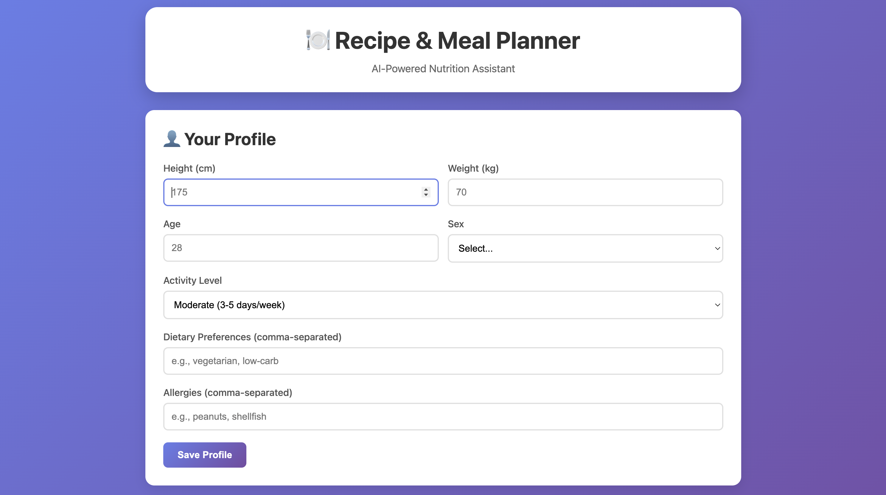
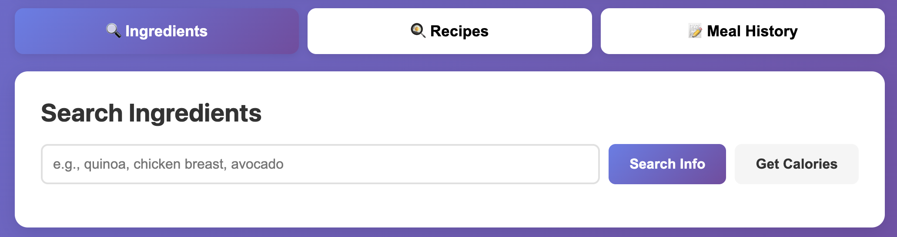
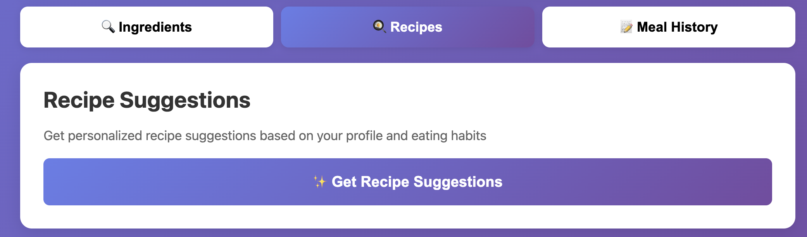
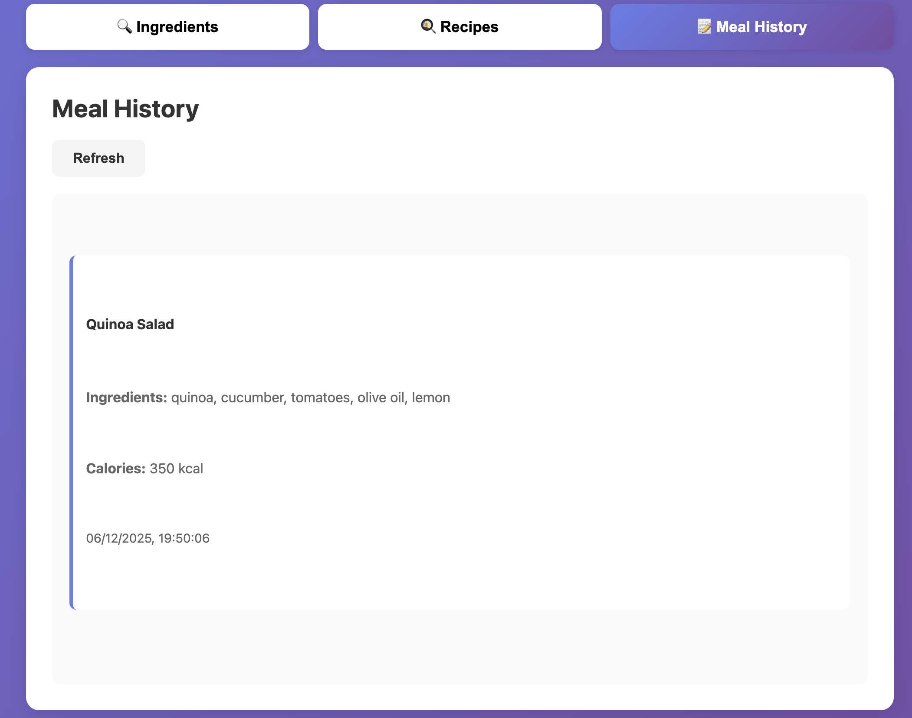

# Recipe & Meal Planner MCP Server

An AI-powered Model Context Protocol (MCP) server for intelligent recipe suggestions and meal planning using Groq's LLama models. This server helps you track nutrition, manage your dietary profile, and get personalized recipe recommendations based on your behavior.

## Features

- **User Profile Management**: Store height, weight, age, sex with automatic BMI calculation
- **Ingredient Search**: Detailed information about ingredients with AI-powered insights
- **Calorie Tracking**: Get accurate nutritional information for any ingredient
- **Smart Recipe Suggestions**: Personalized recommendations based on your profile and eating history
- **Meal Logging**: Track your meals to improve future suggestions
- **Daily Calorie Targets**: Automatic calculation based on your profile and activity level

## Screenshots

### Homepage - Profile Setup


### Ingredient Search


### Recipe Suggestions


### Meal History Tracking


## Installation

```bash
# Install dependencies
npm install

# Set up environment variables
cp .env.example .env
# Edit .env and add your GROQ_API_KEY

# Build the project
npm run build
```

## Configuration

### Environment Variables

Create a `.env` file in the project root:

```bash
# Copy the example file
cp .env.example .env
```

Then edit `.env` and add your Groq API key:

```env
GROQ_API_KEY=your_groq_api_key_here
```

Get your API key from: https://console.groq.com/keys

### MCP Server Setup

Add this server to your MCP settings file:

### For Claude Desktop (MacOS)

Edit: `~/Library/Application Support/Claude/claude_desktop_config.json`

```json
{
  "mcpServers": {
    "recipe-meal-planner": {
      "command": "node",
      "args": [
        "/path/to/recipe-meal-planner-mcp/dist/index.js"
      ]
    }
  }
}
```

### For Cursor IDE

Edit: `~/.cursor/mcp.json`

```json
{
  "mcpServers": {
    "recipe-meal-planner": {
      "command": "node",
      "args": [
        "/path/to/recipe-meal-planner-mcp/dist/index.js"
      ]
    }
  }
}
```

## Web Frontend

This project includes a beautiful web interface for easy interaction.

### Start the Web Server

```bash
npm run web
```

Then open your browser to: **http://localhost:3000**

### Web Features

- Interactive profile setup with real-time BMI calculation
- Ingredient search with AI-powered information
- Calorie lookup with serving size customization
- Personalized recipe suggestions
- Meal logging and history tracking
- Modern, responsive UI with smooth animations

## Available Tools

### 1. `set_user_profile`
Set or update your profile information for personalized recommendations.

**Parameters:**
- `height` (required): Height in centimeters
- `weight` (required): Weight in kilograms
- `age` (required): Age in years
- `sex` (required): "male", "female", or "other"
- `activityLevel` (optional): "sedentary", "light", "moderate", "active", "very_active"
- `dietaryPreferences` (optional): Array of preferences like ["vegetarian", "low-carb"]
- `allergies` (optional): Array of allergies like ["peanuts", "shellfish"]

**Example:**
```
Set my profile: height 175cm, weight 70kg, age 28, male, moderate activity, vegetarian
```

### 2. `get_user_profile`
Retrieve your stored profile including BMI and daily calorie requirements.

**Example:**
```
Show me my profile
```

### 3. `search_ingredient`
Search for detailed information about any ingredient.

**Parameters:**
- `ingredient` (required): The ingredient to search for

**Example:**
```
Search for information about quinoa
```

### 4. `get_calorie_info`
Get detailed nutritional information for an ingredient.

**Parameters:**
- `ingredient` (required): The ingredient name
- `amount` (optional): Serving size (default: 100g)

**Example:**
```
What are the calories in 1 cup of brown rice?
```

### 5. `suggest_recipes`
Get personalized recipe suggestions based on your profile and history.

**Example:**
```
Suggest some recipes for me
```

### 6. `log_meal`
Log a meal you've eaten to improve future suggestions.

**Parameters:**
- `recipe` (required): Name of the meal
- `ingredients` (required): Array of ingredients used
- `totalCalories` (optional): Total calories

**Example:**
```
Log a meal: Chicken Stir Fry with ingredients: chicken breast, broccoli, bell peppers, soy sauce
```

### 7. `get_meal_history`
View your recent meal history.

**Parameters:**
- `limit` (optional): Number of meals to show (default: 10)

**Example:**
```
Show my last 5 meals
```

## Usage Flow

1. **Set Your Profile**
   ```
   Set my profile: height 170cm, weight 65kg, age 30, female, active lifestyle
   ```

2. **Search Ingredients**
   ```
   Tell me about salmon
   What are the calories in 150g of salmon?
   ```

3. **Get Recipe Suggestions**
   ```
   Suggest some healthy dinner recipes
   ```

4. **Log Your Meals**
   ```
   Log meal: Grilled Salmon with ingredients: salmon, lemon, olive oil, asparagus
   ```

5. **Track Your History**
   ```
   Show my meal history
   ```

## How It Works

### BMI Calculation
BMI is automatically calculated using the formula:
```
BMI = weight(kg) / (height(m))²
```

### Daily Calorie Calculation
Uses the Mifflin-St Jeor Equation:
- **For men**: BMR = 10×weight + 6.25×height - 5×age + 5
- **For women**: BMR = 10×weight + 6.25×height - 5×age - 161

Then multiplied by activity level:
- Sedentary: 1.2
- Light: 1.375
- Moderate: 1.55
- Active: 1.725
- Very Active: 1.9

### AI-Powered Suggestions
The server uses Groq's LLama 3.3 70B model to:
- Analyze your profile (BMI, calorie needs, preferences)
- Review your search and meal history
- Generate personalized, nutritionally balanced recipe suggestions

## Data Storage

All data is stored locally in the `data/` directory:
- `user_profile.json`: Your profile information
- `search_history.json`: Last 100 ingredient/recipe searches
- `meal_history.json`: Last 50 logged meals

## Development

```bash
# Watch mode for development
npm run dev

# Build for production
npm run build

# Run MCP server
npm start

# Run web server
npm run web
```

## Tech Stack

- **TypeScript**: Type-safe development
- **MCP SDK**: Model Context Protocol integration
- **Groq SDK**: AI-powered responses using LLama 3.3 70B
- **Node.js**: Runtime environment
- **Express.js**: Web server framework
- **Vanilla JavaScript**: Frontend without heavy frameworks

## Project Highlights

This project demonstrates:
- **MCP Protocol Implementation**: Building custom MCP servers
- **AI Integration**: Using Groq's LLama models for intelligent responses
- **Data Persistence**: JSON-based local storage with history tracking
- **Health Tech**: BMI calculations and nutritional analysis
- **TypeScript**: Strongly typed, production-ready code
- **API Design**: Clean tool interfaces with comprehensive documentation
- **Full-Stack Development**: Backend API + Frontend UI

## Future Enhancements

- Integration with food APIs (USDA, Spoonacular)
- Image recognition for meal logging
- Trend analysis and reporting
- Shopping list generation
- Meal prep planning
- Reminder system
- Export meal plans to PDF
- Multi-user support with authentication

## Contributors

- **Nishchay Deep**
- **Yash Pandey**

## License

MIT

---

Built with Groq AI and Model Context Protocol
